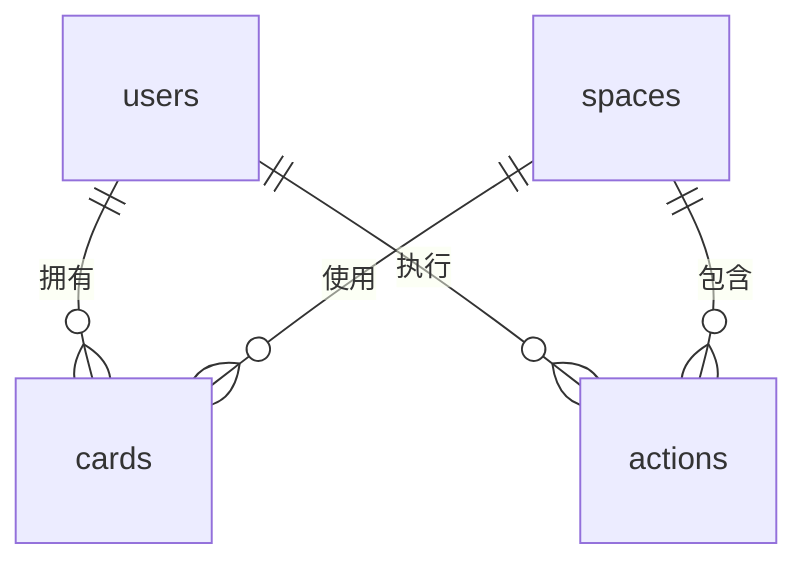

# API设计文档

## 目录
- [认证授权](#认证授权)
- [空间管理](#空间管理)
- [卡牌管理](#卡牌管理)
- [行动管理](#行动管理)
- [状态同步](#状态同步)
- [错误处理](#错误处理)

## 基础信息
### 请求头
```
Authorization: Bearer {token}
Content-Type: application/json
```

### 响应格式
```json
{
  "success": true,
  "code": "SUCCESS",
  "message": "操作成功",
  "data": {},
  "timestamp": 1714387200
}
```

## 认证授权

### 用户登录
```http
POST /api/auth/login
```
请求体：
```json
{
  "username": "string",
  "password": "string"
}
```
响应：
```json
{
  "token": "string",
  "user": {
    "id": "string",
    "username": "string",
    "experience": 0,
    "energy": 100
  }
}
```

## 空间管理

### 获取空间列表
```http
GET /api/game/spaces
```
参数：
- type: temp|stable|fixed
- limit: int (默认10)
- page: int (默认1)

响应：
```json
{
  "spaces": [
    {
      "id": "string",
      "name": "string",
      "type": "string",
      "stability": 0,
      "member_count": 0,
      "description": "string"
    }
  ],
  "pagination": {
    "total": 0,
    "per_page": 10,
    "current_page": 1
  }
}
```

### 获取空间详情
```http
GET /api/game/spaces/{space_id}/status
```
响应：
```json
{
  "space": {
    "id": "string",
    "name": "string",
    "turns_left": 0,
    "participants": [
      {
        "user_id": "string",
        "username": "string"
      }
    ],
    "history": [
      {
        "action_id": "string",
        "content": "string",
        "timestamp": 0
      }
    ]
  }
}
```

## 卡牌管理

### 获取卡牌列表
```http
GET /api/game/cards
```
参数：
- owner_id: string (用户ID)

响应：
```json
{
  "cards": [
    {
      "id": "string",
      "name": "string",
      "strength": 0,
      "is_replica": false,
      "heat": 0
    }
  ]
}
```

### 使用卡牌
```http
POST /api/game/cards/use
```
请求体：
```json
{
  "card_id": "string",
  "space_id": "string"
}
```
响应：
```json
{
  "effect": "string",
  "energy_cost": 0,
  "new_stability": 0
}
```

## 行动管理

### 提交行动
```http
POST /api/game/actions
```
请求体：
```json
{
  "space_id": "string",
  "action_type": "string",
  "content": "string"
}
```
响应：
```json
{
  "action_id": "string",
  "result": "string",
  "turns_left": 0
}
```

### 获取行动历史
```http
GET /api/game/actions/history
```
参数：
- space_id: string
- limit: int (默认20)
- page: int (默认1)

响应：
```json
{
  "history": [
    {
      "action_id": "string",
      "user_id": "string",
      "content": "string",
      "timestamp": 0
    }
  ]
}
```

## 状态同步

### 订阅空间状态
```http
GET /api/game/spaces/{space_id}/updates
```
响应(SSE)：
```
event: space_update
data: {"turns_left": 10}

event: participant_update  
data: {"action": "join", "user_id": "123"}
```

## 错误处理

### 错误码表
| 错误码 | HTTP状态码 | 描述 |
|--------|------------|------|
| AUTH_REQUIRED | 401 | 需要认证 |
| INVALID_TOKEN | 403 | 无效令牌 |
| RATE_LIMITED | 429 | 请求过于频繁 |
| SPACE_FULL | 400 | 空间已满 |
| INSUFFICIENT_ENERGY | 400 | 体力不足 |

### 错误响应示例
```json
{
  "success": false,
  "code": "INSUFFICIENT_ENERGY",
  "message": "体力不足",
  "details": {
    "required": 10,
    "current": 5
  },
  "timestamp": 1714387200
}
```

## 附录

### 数据库表关系


### 技术实现说明
1. 使用FastAPI实现RESTful接口
2. 数据库操作使用SQLAlchemy ORM
3. 实时更新使用Server-Sent Events(SSE)
4. 缓存使用Redis
5. 文档生成使用Swagger UI
