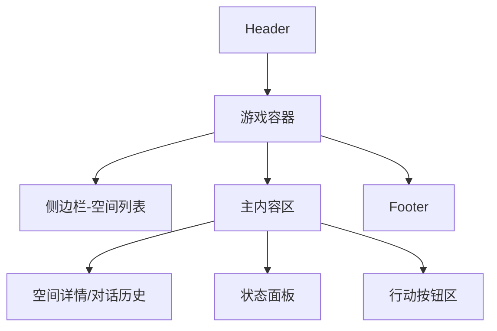
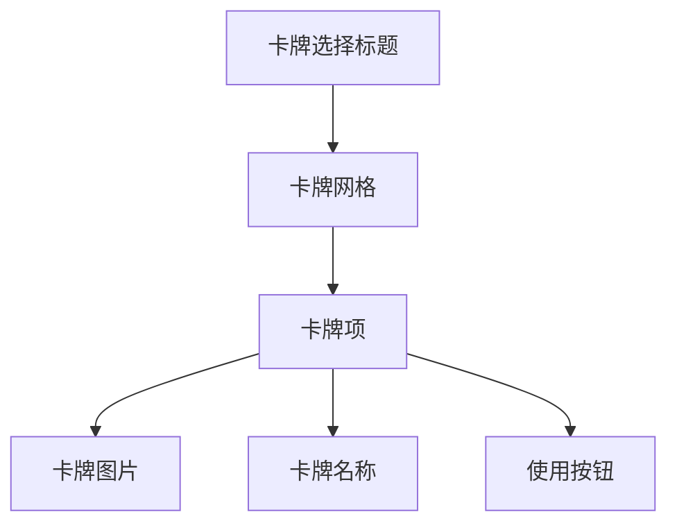

# 游戏界面UI设计文档

## 目录
- [整体布局](#整体布局)
- [空间列表视图](#空间列表视图)
- [空间详情视图](#空间详情视图)
- [状态面板](#状态面板)
- [行动交互区](#行动交互区)
- [动画效果](#动画效果)
- [响应式设计](#响应式设计)

## 整体布局


## 空间列表视图
### 设计要点
- 分类显示临时/稳定/固化空间
- 每个空间项包含：
  - 空间名称
  - 稳定度指示器
  - 成员数量
- 悬停效果：
  ```css
  .space-item:hover {
    background: #f5f5f5;
    transform: translateX(5px);
  }
  ```

## 空间详情视图
### 组件结构
1. 返回按钮
2. 空间标题和状态
3. 对话历史区域
   - 分页加载
   - 用户/AI回复区分样式
4. 宝物展示区
   - 3D物品展示
   - 鉴定按钮

## 状态面板
| 元素 | 样式 | 数据源 |
|------|------|--------|
| 体力值 | 进度条 | energy |
| 资历值 | 数字显示 | experience |
| 剩余轮次 | 数字显示 | turnCount |

## 行动交互区
### 主要按钮
1. 探索行动按钮
   - 攻击向
   - 防御向
   - 调查向
2. 卡牌使用按钮
   - 弹出卡牌选择界面
3. 自定义行动输入框

### 卡牌选择界面


## 动画效果
1. 页面切换动画：
   ```css
   @keyframes fadeIn {
     from { opacity: 0; transform: translateY(10px); }
     to { opacity: 1; transform: translateY(0); }
   }
   ```
2. 按钮悬停效果
3. 卡牌使用动画

## 响应式设计
| 屏幕宽度 | 布局调整 |
|----------|----------|
| >1200px | 侧边栏+主内容 |
| 768-1200px | 折叠侧边栏 |
| <768px | 移动端优化布局 |

## 设计规范
1. 颜色方案：
   - 主色调: #3b82f6 (蓝色)
   - 辅助色: #10b981 (绿色)
   - 警告色: #ef4444 (红色)
2. 间距系统：
   - 基础单位: 8px
   - 间距: 8px/16px/24px
3. 字体：
   - 主要: system-ui
   - 代码: Monaco, monospace
