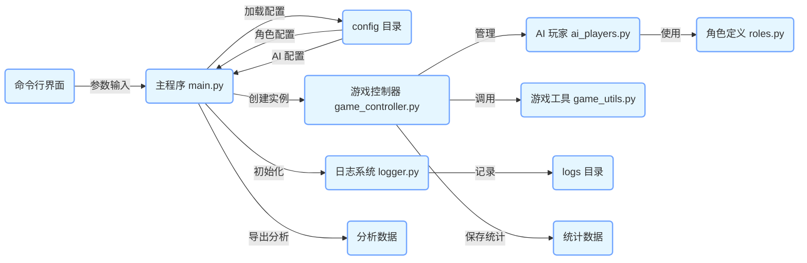
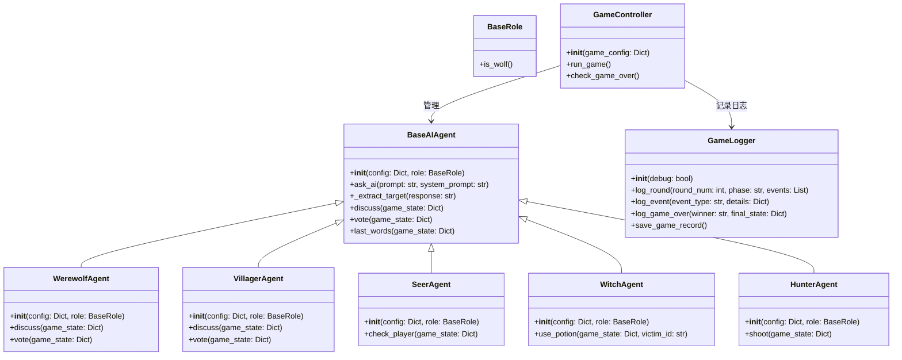
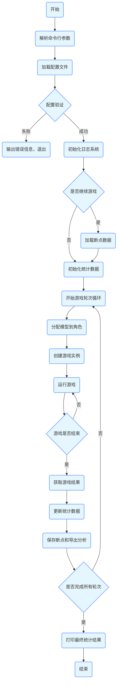

以下是根据项目代码分析生成的包含架构图、类图和流程图的 Markdown 文档：
  - [wolf_game](https://github.com/hikariming/AIWolfGame)：AI狼人杀游戏

# AI 狼人杀模拟器项目架构分析

## 架构图

**说明**：
- 命令行界面通过参数输入启动主程序。
- 主程序加载配置文件，初始化日志系统，并创建游戏控制器实例。
- 游戏控制器管理 AI 玩家，调用游戏工具函数。
- AI 玩家使用角色定义。
- 日志系统记录游戏过程到日志目录。
- 游戏结束后，主程序导出分析数据。

## 类图

**说明**：
- `BaseRole` 是角色的基类，定义了判断是否为狼人的方法。
- `BaseAIAgent` 是 AI 玩家的基类，定义了通用的方法。
- `WerewolfAgent`、`VillagerAgent`、`SeerAgent`、`WitchAgent` 和 `HunterAgent` 继承自 `BaseAIAgent`，并实现了各自的特殊方法。
- `GameController` 管理游戏流程，与 AI 玩家交互，并使用 `GameLogger` 记录日志。

## 流程图

**说明**：
1. 程序开始后，解析命令行参数，加载配置文件并进行验证。
2. 初始化日志系统，根据用户选择决定是否从断点继续游戏。
3. 进入游戏轮次循环，分配模型到角色，创建游戏实例并运行游戏。
4. 游戏结束后，获取结果，更新统计数据，保存断点和导出分析。
5. 检查是否完成所有轮次，若未完成则继续循环，否则打印最终统计结果并结束程序。