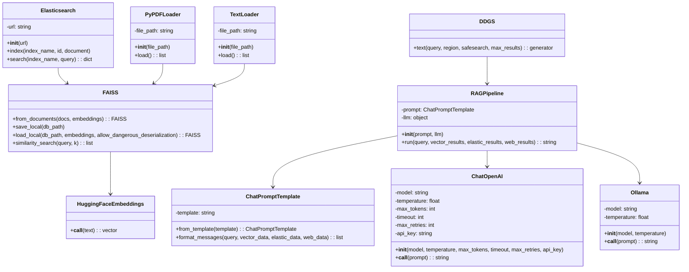

  - [ChatQ](https://github.com/Jocker-123/ChatQ):a Local Retrieval-Augmented Generation (RAG) system. This project leverages FastAPI and integrates cutting-edge technologies like vector search, Elasticsearch, and optional web search. With ChatQ, you can harness the power of large language models (LLMs) such as Mistral or GPT-4 for intelligent question answering.

# ChatQ 项目架构分析文档

## 项目概述
ChatQ 是一个本地检索增强生成（RAG）系统，利用 FastAPI 构建，集成了向量搜索、Elasticsearch 和可选的网络搜索功能。该系统借助大型语言模型（LLMs）如 Mistral 或 GPT - 4 实现智能问答。

## 架构图

**架构图说明**：
- **前端**：Web UI 负责与用户交互，通过 HTTP 请求将用户的问题发送到后端的 FastAPI 服务器。
- **后端**：
  - FastAPI Server 作为核心，接收前端请求并分发给不同的搜索和处理模块。
  - LLM Pipeline 负责调用大型语言模型进行问题解答。
  - Vector Search 和 Elasticsearch Search 分别从向量数据库和 Elasticsearch 中检索相关信息。
  - Web Search 从互联网上获取实时数据。
- **数据库**：
  - Vector Database 存储向量数据，用于向量搜索。
  - Elasticsearch 作为分布式搜索和分析引擎，提供强大的搜索功能。

## 类图

**类图说明**：
- **模型类**：ChatOpenAI 和 Ollama 分别代表 OpenAI 和 Ollama 的大语言模型接口。
- **模板类**：ChatPromptTemplate 用于生成向大语言模型输入的提示信息。
- **向量数据库类**：FAISS 负责向量数据的存储、加载和搜索。
- **搜索引擎类**：Elasticsearch 用于从 Elasticsearch 数据库中检索信息。
- **数据加载类**：PyPDFLoader 和 TextLoader 用于加载不同格式的文档。
- **嵌入类**：HuggingFaceEmbeddings 用于生成文本的向量表示。
- **服务类**：RAGPipeline 整合了各个组件，实现检索增强生成的核心逻辑。

## 流程图

**流程图说明**：
1. 用户在 Web UI 输入问题。
2. Web UI 将问题发送到 FastAPI Server。
3. FastAPI Server 对问题进行处理，分别调用向量搜索、Elasticsearch 搜索和网络搜索。
4. 各个搜索模块返回结果到 LLM Pipeline。
5. LLM Pipeline 利用这些结果和大语言模型生成答案。
6. 答案通过 FastAPI Server 返回给 Web UI。
7. Web UI 显示答案给用户。

通过以上架构图、类图和流程图，我们可以全面了解 ChatQ 项目的整体结构、主要组件及其相互关系，以及关键业务流程。