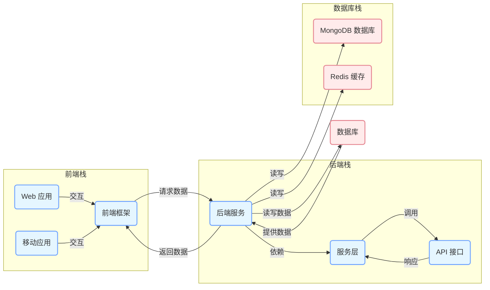
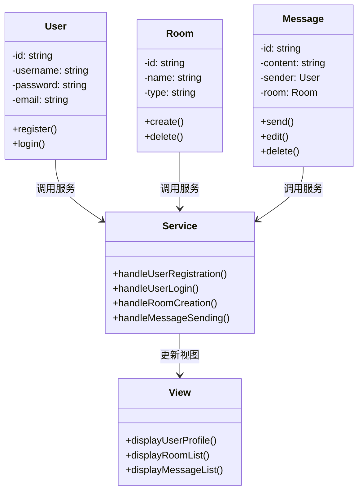
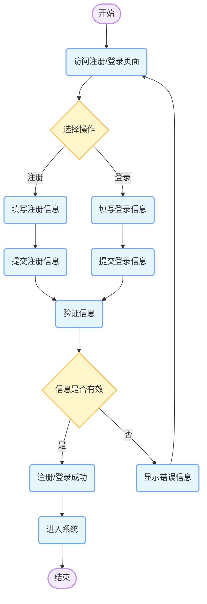

  - [Rocket.Chat](https://github.com/RocketChat/Rocket.Chat):一个开源的聊天平台，支持团队协作、群组聊天、私人消息等功能。它有类似于 Discord 的服务器和频道概念，可用于创建各种社区。
以下是使用 Mermaid 为 Rocket.Chat 项目创建的架构图、类图和流程图的 Markdown 文件内容：

# Rocket.Chat 项目架构与设计图表

## 架构图

### 架构图说明
此架构图展示了 Rocket.Chat 项目的主要组件及其相互关系。前端包括 Web 应用和移动应用，它们通过前端框架与后端服务进行交互。后端服务依赖服务层和 API 接口，负责处理业务逻辑和数据请求。数据库使用 MongoDB 存储主要数据，Redis 作为缓存提高性能。

## 类图

### 类图说明
该类图展示了 Rocket.Chat 项目中主要类的定义及其继承关系。`User` 类代表用户，`Room` 类代表聊天房间，`Message` 类代表消息。`Service` 类处理业务逻辑，`View` 类负责展示界面。用户、房间和消息类通过调用服务类的方法来完成业务操作，服务类更新视图类以展示相应的信息。

## 流程图 - 用户注册与登录

### 流程图说明
此流程图描绘了 Rocket.Chat 项目中用户注册和登录的关键业务流程。用户首先访问注册/登录页面，选择注册或登录操作，填写相应信息并提交。系统验证信息的有效性，如果信息有效则注册/登录成功，进入系统；否则显示错误信息，用户需要重新填写信息。

以上图表通过 Mermaid 工具创建，展示了 Rocket.Chat 项目的整体结构、主要类之间的关系以及关键业务流程。这些图表有助于开发者和相关人员更好地理解项目的架构和设计。