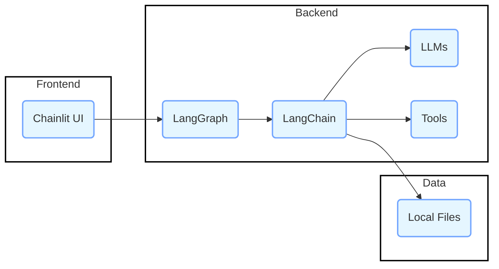
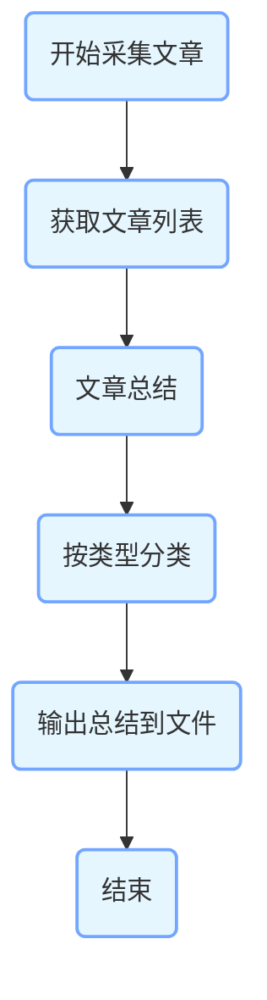
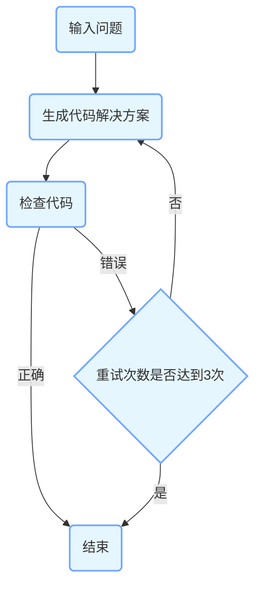
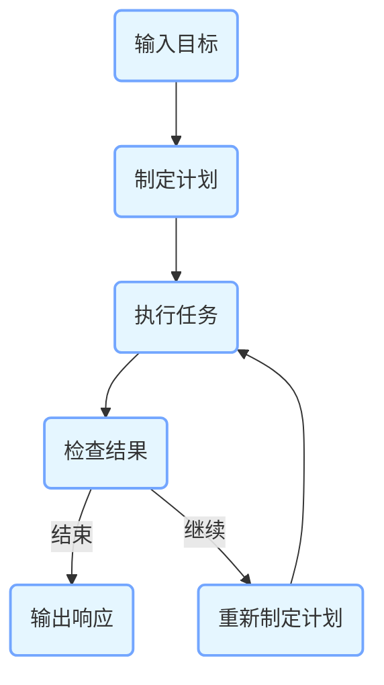

以下是根据项目代码生成的包含架构图、类图及流程图的 Markdown 文档：

# [langgraph-demo](https://github.com/q2wxec/langgraph-demo) 项目架构分析

## 架构图

**说明**：
- **前端**：使用 Chainlit 构建用户界面，与后端进行交互。
- **后端**：
  - **LangGraph**：作为核心的流程管理框架，负责协调各个组件的运行。
  - **LangChain**：用于构建和管理与大语言模型的交互。
  - **LLMs**：包括多种大语言模型，如 `glm-4-long`、`qwen-plus`、`spark-3.1` 等。
  - **Tools**：包含各种工具，如搜索工具、绘图工具等。
- **数据**：主要存储在本地文件中，如 `.csv`、`.md` 等。

## 类图
```mermaid
classDiagram
    class GraphState {
        keys: dict
    }
    class PlanExecute {
        input: str
        plan: list
        past_steps: tuple
        response: object
    }
    class AgentState {
        messages: list
    }
    class Plan {
        steps: list
    }
    class Response {
        end: bool
        response: object
    }
    
    class ChatOpenAI {
        model: str
        temperature: float
        openai_api_base: str
        openai_api_key: str
        +invoke()
    }
    class PromptTemplate {
        template: str
        input_variables: list
        +from_template()
    }
    class StrOutputParser {
        +invoke()
    }
    class JsonOutputParser {
        +invoke()
    }
    class PydanticOutputParser {
        pydantic_object: object
        +invoke()
    }
    
    class ZhipuAI {
        api_key: str
        +chat.completions.create()
    }
    
    class Tool {
        name: str
        +invoke()
    }
    class AddTool {
        <<Tool>>
        +invoke()
    }
    class MultiplyTool {
        <<Tool>>
        +invoke()
    }
    class ExponentiateTool {
        <<Tool>>
        +invoke()
    }
    
    ChatOpenAI <|-- ZhipuAI
    Tool <|-- AddTool
    Tool <|-- MultiplyTool
    Tool <|-- ExponentiateTool
    
    GraphState "1" -- "*" "Graph Functions" : used by
    PlanExecute "1" -- "*" "Plan Functions" : used by
    AgentState "1" -- "*" "Agent Functions" : used by
    Plan "1" -- "1" "Plan Agent" : used by
    Response "1" -- "1" "Check Result Agent" : used by
    
    ChatOpenAI "1" -- "*" "Chains" : used by
    PromptTemplate "1" -- "*" "Chains" : used by
    StrOutputParser "1" -- "*" "Chains" : used by
    JsonOutputParser "1" -- "*" "Chains" : used by
    PydanticOutputParser "1" -- "*" "Chains" : used by
```
**说明**：
- **状态类**：`GraphState`、`PlanExecute` 和 `AgentState` 分别用于不同模块的状态管理。
- **模型类**：`Plan` 和 `Response` 用于定义计划和响应的结构。
- **工具类**：`ChatOpenAI`、`PromptTemplate`、`StrOutputParser`、`JsonOutputParser` 和 `PydanticOutputParser` 是 LangChain 提供的工具类。
- **自定义工具类**：`AddTool`、`MultiplyTool` 和 `ExponentiateTool` 是自定义的工具类。

## 流程图
### 文章总结流程

**说明**：
1. 开始采集文章，调用 `get_article_content` 函数获取文章列表。
2. 对每篇文章进行总结，使用 `PromptTemplate` 和 `ChatOpenAI` 生成总结内容。
3. 将文章按类型分类，存储在字典中。
4. 将总结内容输出到 `daily_summary.md` 文件中。

### 代码生成流程

**说明**：
1. 用户输入问题，调用 `generate` 函数生成代码解决方案。
2. 调用 `code_mentor` 函数检查代码的正确性。
3. 如果代码正确，流程结束；否则，判断重试次数是否达到 3 次。
4. 如果重试次数未达到 3 次，返回步骤 2 重新生成代码；否则，流程结束。

### 计划执行流程

**说明**：
1. 用户输入目标，调用 `planner` 函数制定计划。
2. 调用 `agent_executor` 函数执行计划中的任务。
3. 调用 `result_checker` 函数检查任务执行结果。
4. 如果结果满足结束条件，输出响应；否则，调用 `replanner` 函数重新制定计划，返回步骤 2 继续执行。