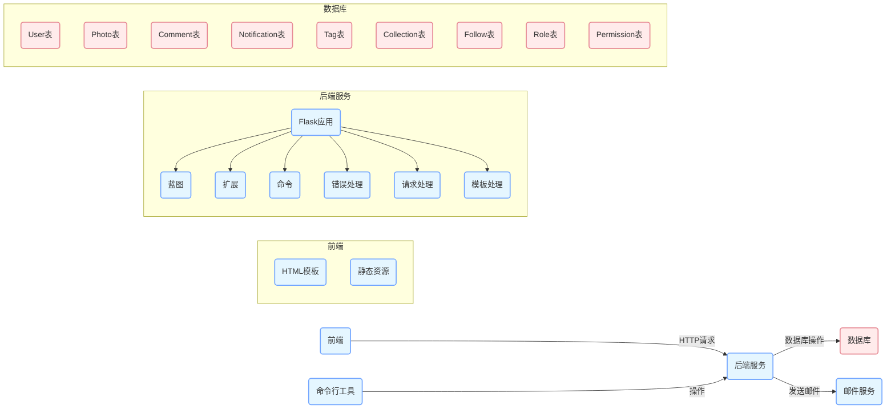
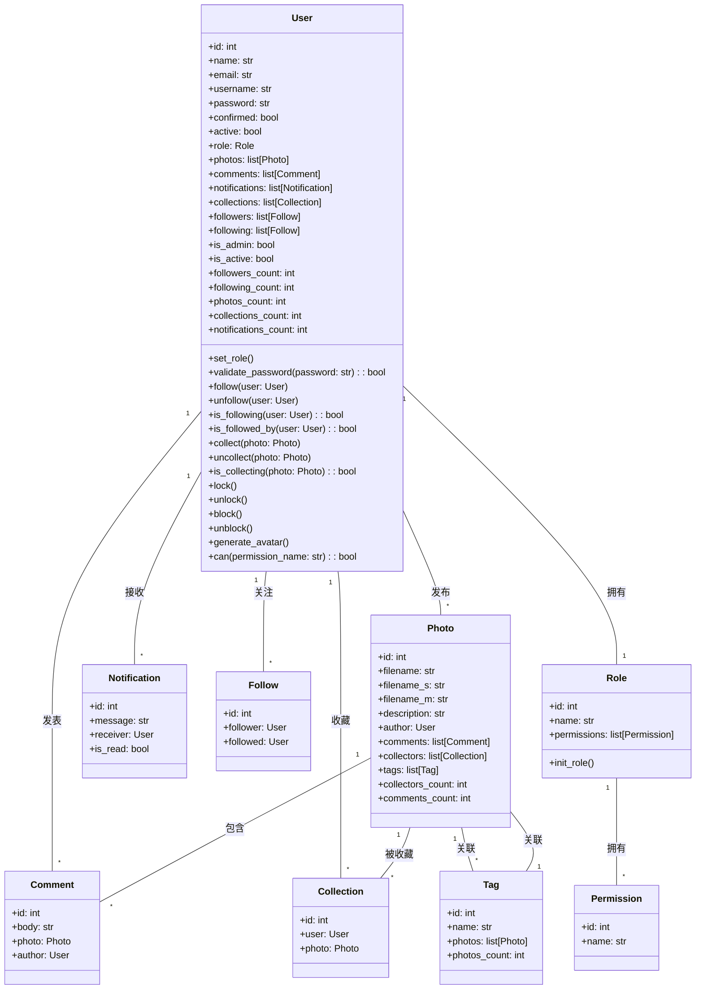
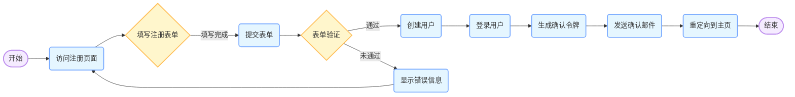
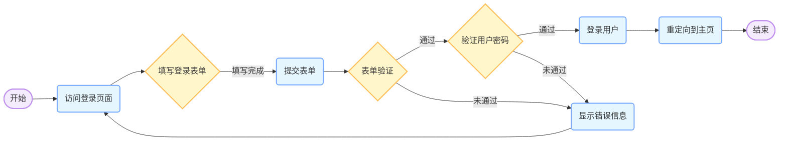
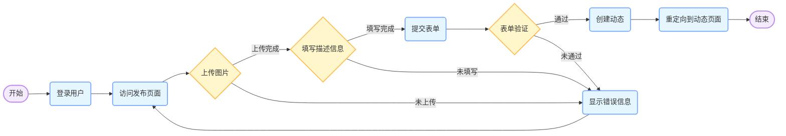

  - [moments](https://github.com/greyli/moments)：一个基于Flask的社交网络项目

以下是使用 Mermaid 创建的架构图、类图和流程图，用于分析 `moments` 项目：

### 架构图

### 类图

### 流程图 - 用户注册流程

### 流程图 - 用户登录流程

### 流程图 - 发布动态流程

以上图表展示了 `moments` 项目的整体架构、主要类的关系以及关键业务流程。通过这些图表，可以更直观地理解项目的结构和功能。