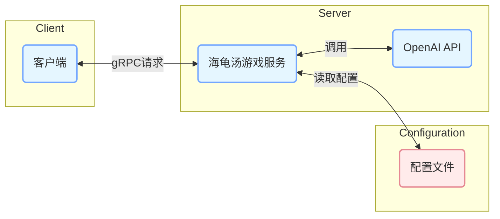
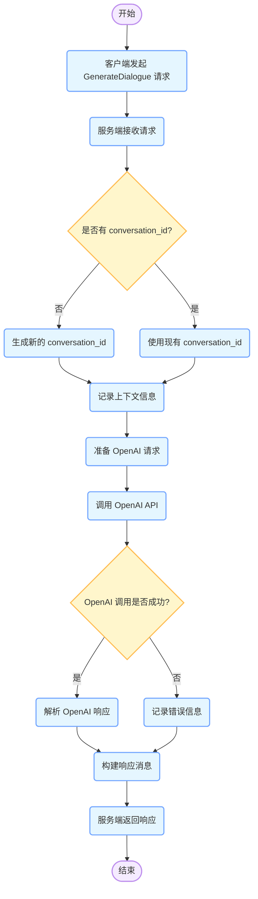

以下是为 `turtle-soup-game-service` 项目生成的包含架构图、类图和流程图的 Markdown 文档：
  - [turtle-soup-game-service](https://github.com/amazingchow/turtle-soup-game-service) : AI 海龟汤游戏

# 项目架构分析

## 架构图

### 架构说明
- **客户端**：向海龟汤游戏服务发起 gRPC 请求，与服务进行交互。
- **海龟汤游戏服务**：处理客户端的请求，根据配置调用 OpenAI API 生成对话，并将结果返回给客户端。
- **OpenAI API**：提供自然语言处理能力，用于生成对话内容。
- **配置文件**：存储服务的配置信息，如 API 地址、模型名称等。

## 类图
```mermaid
classDiagram
    class TurtleSoupGameService {
        - _env: str
        - _openai_conf_intention_model: str
        - _openai_conf_intention_model_version: str
        - _openai_conf_chat_model: str
        - _openai_conf_chat_model_version: str
        - _openai_key_list: list
        - _openai_conf_chat_model_max_tokens: int
        - _openai_conf_chat_enable_memory: bool
        + __init__(conf: Dict[str, Any])
        + close()
        + new_conversation_id(uid: str, rid: str): str
        + Ping(request: PingRequest, context: ServicerContext): PongResponse
        + GenerateDialogue(request: GenerateDialogueRequest, context: ServicerContext): GenerateDialogueResponse
    }
    class PingRequest {
        + 无属性
    }
    class PongResponse {
        + 无属性
    }
    class GenerateDialogueRequest {
        + conversation_id: str
        + llm_engine: LLMEngine
        + conversation_system_prompt: str
        + to_reply_for_general_question: bool
        + chat: str
        + ext_thread_id: str
        + ext_uid: str
        + ext_nickname: str
    }
    class GenerateDialogueResponse {
        + ret: AIResult
        + conversation_id: str
        + chat: str
        + ext_thread_id: str
        + ext_uid: str
    }
    class AIResult {
        + code: uint32
        + msg: str
    }
    enum LLMEngine {
        OPENAI
        AZURE
        GEMINI
        CLAUDE
    }
    TurtleSoupGameService --|> TurtleSoupGameServiceServicer
    TurtleSoupGameService "1" --> "1..*" GenerateDialogueRequest : 处理请求
    TurtleSoupGameService "1" --> "1..*" GenerateDialogueResponse : 返回响应
    GenerateDialogueRequest "1" --> "1" AIResult : 包含
    GenerateDialogueResponse "1" --> "1" AIResult : 包含
    GenerateDialogueRequest "1" --> "1" LLMEngine : 使用
```
### 类图说明
- **TurtleSoupGameService**：服务类，继承自 `TurtleSoupGameServiceServicer`，处理客户端的请求，包括 `Ping` 和 `GenerateDialogue` 方法。
- **PingRequest** 和 **PongResponse**：用于 `Ping` 方法的请求和响应消息。
- **GenerateDialogueRequest** 和 **GenerateDialogueResponse**：用于 `GenerateDialogue` 方法的请求和响应消息。
- **AIResult**：表示 AI 处理结果，包含错误码和错误消息。
- **LLMEngine**：枚举类型，表示使用的大语言模型引擎。

## 流程图

### 流程图说明
1. 客户端发起 `GenerateDialogue` 请求。
2. 服务端接收请求，检查是否有 `conversation_id`，如果没有则生成新的 `conversation_id`。
3. 记录上下文信息，准备 OpenAI 请求。
4. 调用 OpenAI API 生成对话内容。
5. 检查 OpenAI 调用是否成功，如果成功则解析响应，否则记录错误信息。
6. 构建响应消息并返回给客户端。

以上图表展示了 `turtle-soup-game-service` 项目的整体架构、类结构和关键业务流程，有助于理解项目的设计和实现。