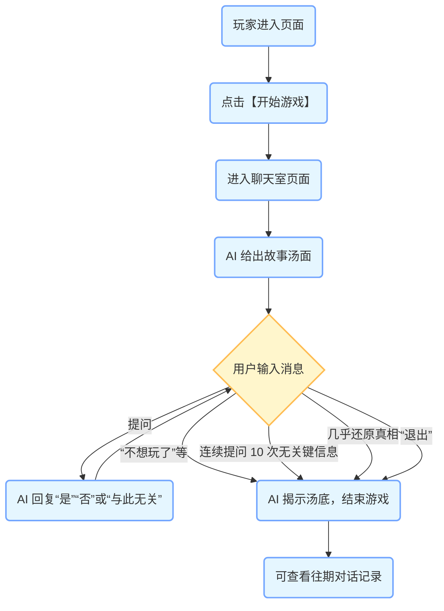

以下是根据你提供的代码和信息生成的包含架构图、类图和流程图的 Markdown 文档：
  - [yuhaigui-ai-game](https://github.com/liyupi/yuhaigui-ai-game)  : AI 海龟汤游戏

# AI 海龟汤游戏项目架构分析

## 架构图
```mermaid
graph LR
    classDef process fill:#E5F6FF,stroke:#73A6FF,stroke-width:2px;
    classDef data fill:#FFEBEB,stroke:#E68994,stroke-width:2px;
    
    subgraph 前端
    style 前端 fill:#ffffff,stroke:#000000,stroke-width:2px
    FE(Vue.js 前端):::process
    end
    
    subgraph 后端
    style 后端 fill:#ffffff,stroke:#000000,stroke-width:2px
    BE(Spring Boot 后端):::process
    BES(ChatService):::process
    BEM(AiManager):::process
    end
    
    subgraph 数据库
    style 数据库 fill:#ffffff,stroke:#000000,stroke-width:2px
    DB(MySQL 数据库):::data
    end
    
    subgraph AI 服务
    style AI 服务 fill:#ffffff,stroke:#000000,stroke-width:2px
    AI(火山引擎方舟推理服务):::process
    end
    
    FE -->|HTTP 请求| BE
    BE -->|数据交互| DB
    BE -->|API 调用| AI
    BES -->|依赖调用| BEM
```
**说明**：
- 前端使用 Vue.js 框架，负责用户界面的展示和交互。
- 后端采用 Spring Boot 框架，提供服务接口。
- 数据库使用 MySQL 存储相关数据。
- 后端通过 API 调用火山引擎方舟推理服务实现 AI 功能。

## 类图
```mermaid
classDiagram
    class ChatService {
        +doChat(long roomId, String message): String
        +getChatRoomList(): List<ChatRoom>
    }
    
    class ChatServiceImpl {
        -AiManager aiManager
        -Map<Long, List<ChatMessage>> globalMessagesMap
        +doChat(long roomId, String message): String
        +getChatRoomList(): List<ChatRoom>
    }
    
    class AiManager {
        -ArkService arkService
        +doChat(String systemPrompt, String userPrompt): String
        +doChat(List<ChatMessage> chatMessageList): String
    }
    
    class ChatRoom {
        -long roomId
        -List<ChatMessage> chatMessageList
        +getRoomId(): long
        +setRoomId(long roomId)
        +getChatMessageList(): List<ChatMessage>
        +setChatMessageList(List<ChatMessage> chatMessageList)
    }
    
    class ChatMessage {
        -ChatMessageRole role
        -String content
        +getRole(): ChatMessageRole
        +setRole(ChatMessageRole role)
        +getContent(): String
        +setContent(String content)
    }
    
    enum ChatMessageRole {
        SYSTEM
        USER
        ASSISTANT
    }
    
    ChatService <|.. ChatServiceImpl : 实现
    ChatServiceImpl --> AiManager : 依赖
    ChatServiceImpl --> ChatRoom : 关联
    ChatServiceImpl --> ChatMessage : 关联
    AiManager --> ArkService : 依赖
    ChatRoom --> ChatMessage : 关联
```
**说明**：
- `ChatService` 是聊天服务的接口，`ChatServiceImpl` 是其实现类。
- `AiManager` 负责与 AI 服务进行交互。
- `ChatRoom` 表示聊天室，包含多个 `ChatMessage`。
- `ChatMessage` 表示聊天消息，有不同的角色（`ChatMessageRole`）。

## 流程图

**说明**：
- 玩家进入页面后点击开始游戏，进入聊天室，AI 给出故事汤面。
- 用户可以提问，AI 根据规则回复。
- 在特定条件下，游戏结束，AI 揭示汤底。
- 游戏结束后，用户可以查看往期对话记录。

以上图表展示了 AI 海龟汤游戏项目的整体架构、类之间的关系以及关键业务流程。通过这些图表，可以更直观地理解项目的结构和运行机制。