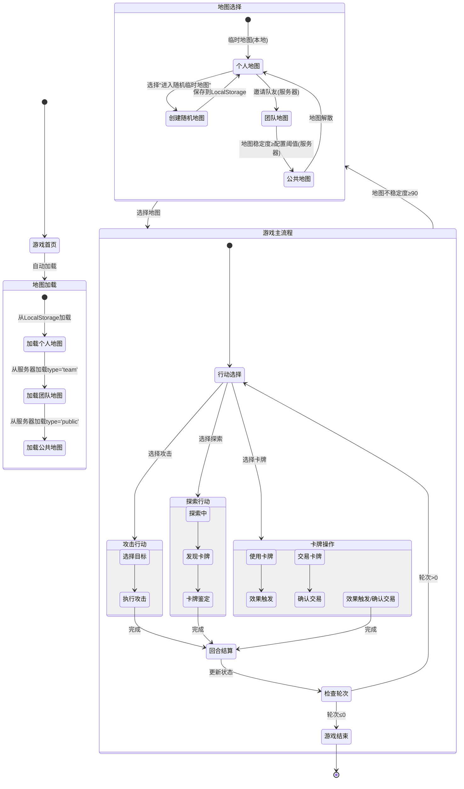

# 论坛风格重构详细计划

## 1. 数据模型设计

### 服务器配置表
```python
class ServerConfig(BaseModel):
    configs: Dict[str, Union[int, str]] = {
        "space_stability_threshold": 80,  # 地图稳定转化线
        "energy_recovery_rate": 10,       # 体力恢复时间(分钟)
        "max_energy": 256                # 最大体力值
    }
```

### 用户模型扩展
```python
class User(BaseModel):
    # 现有字段...
    experience: int = 0  # 资历
    energy: int = 256    # 体力值(上限256)
    energy_recovery_at: datetime  # 体力恢复时间
```

### 地图模型
```python
class Space(BaseModel):
    id: UUID
    type: Literal["personal", "team", "public"]
    stability: int = 100  # 稳定度(0-100)
    turns_left: int = 10   # 剩余轮次
    created_at: datetime
    updated_at: datetime
    storage_location: Literal["local", "server"]  # 存储位置

# 个人地图使用LocalStorage保存
class PersonalSpace(Space):
    storage_location: Literal["local"] = "local"
    
# 团队/公共地图使用服务器保存    
class ServerSpace(Space):
    storage_location: Literal["server"] = "server"
```

### 卡牌模型
```python
class Treasure(BaseModel):
    id: UUID
    name: str
    effect: str
    strength: int = Field(ge=0, le=256)  # 强度值(0-256)
    is_replica: bool = False  # 是否为复制品
    deviation: int = 0       # 故事线偏离度减值 
    heat: int = 0            # 热度加值
    owner_id: UUID           # 拥有者ID
```

## 2. API接口设计

### 地图API
- `GET /api/game/spaces` - 获取地图列表
- `POST /api/game/spaces/{space_id}/actions` - 提交地图行动
- `GET /api/game/spaces/{space_id}/status` - 获取地图状态

### 行动API
- `POST /api/game/actions` - 提交行动(攻击/驻防/探索/使用卡牌)
- `GET /api/game/actions/history` - 获取行动历史

### 卡牌API
- `GET /api/game/treasures` - 获取卡牌列表 
- `POST /api/game/treasures/{id}/identify` - 鉴定卡牌
- `POST /api/game/treasures/{id}/use` - 使用卡牌
- `POST /api/game/treasures/transfer` - 交易卡牌

## 3. 数据库脚本


## 4. 实现路线图

### 第一阶段：基础架构
1. 实现数据模型和数据库迁移
2. 开发核心API接口
3. 实现基础状态管理

### 第二阶段：游戏逻辑
1. 实现行动处理系统
2. 开发回合结算逻辑
3. 集成AI生成功能

### 第三阶段：前端优化
1. 重构地图可视化组件
2. 优化卡牌交互界面
3. 增强状态显示面板

## 5. 测试计划

1. 单元测试：覆盖核心游戏逻辑
2. 接口测试：验证API功能
3. 集成测试：测试完整游戏流程
4. 性能测试：评估高并发场景

## 6. 游戏流程控制交互图



### 流程说明：
1. **地图选择阶段**：
   - 玩家可选择个人/团队/公共地图
   - 地图类型影响后续游戏玩法
   - 地图稳定度决定可玩轮次

2. **行动选择**：
   - 每回合可选择攻击/探索/卡牌操作
   - 不同行动消耗不同体力值
   - 行动结果影响游戏状态

3. **回合结算**：
   - 更新地图稳定度
   - 减少剩余轮次
   - 恢复部分体力(每10分钟1点)

4. **游戏结束条件**：
   - 轮次耗尽
   - 地图稳定度≤10
   - 玩家体力耗尽
