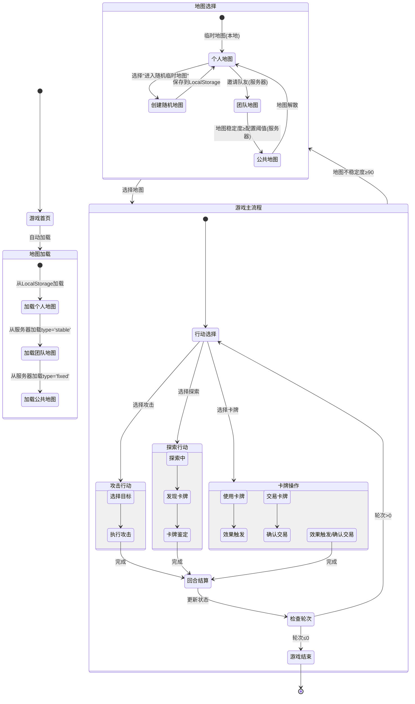

# 论坛风格重构详细计划

## 目录
- [数据库脚本设计](#数据模型设计)
- [游戏流程控制](#游戏流程控制交互图)
- [核心要素拆解](#核心要素拆解)
- [API接口](#api接口列表)
- [API文档示例](#api-文档示例)

## 数据模型设计docs\论坛风详细设计.md

1. **服务器配置表(server_configs)**
   - 用途：存储游戏系统参数配置
   - 关键字段：
     - config_key: 配置键名(主键)
     - config_value: 配置值(JSON格式)
     - data_type: 数据类型(INT/STRING/BOOLEAN)
   - 特性：支持游戏运行时动态调整参数

2. **用户表(users)**
   - 扩展字段：
     - experience: BIGINT 资历值
     - energy: INT 当前体力值
     - energy_updated_at: TIMESTAMP 最后更新时间

   - 体力日志表(energy_logs)：记录变化明细
   - 资历日志表(experience_logs)：记录来源和数值

3. **卡牌表(treasures)**
   - 特殊字段：
     - is_replica: BOOLEAN 复制品标记(影响交易价值)
     - deviation: INT 偏离度(范围0-100)
     - heat: INT 热度值(基于访问频率计算)
   - 数据类型建议：
     - strength: TINYINT UNSIGNED (0-255)
     - deviation: TINYINT UNSIGNED (0-100)
     - heat: MEDIUMINT (支持高频更新)
   - 索引策略：
     - 主键: id
     - 外键: owner_id关联users表
     - 复合索引: (owner_id, heat) 用于玩家卡牌排序

4. **空间表(spaces)**
   - 用途：记录游戏地图空间信息
   - 核心字段：
     - type: 空间类型(ENUM: temp/stable/fixed)
       - temp: 临时地图(用户本地无期限保存)
       - stable: 稳定地图(需维护稳定度)
       - fixed: 固化地图(永久保存)
     - stability: 当前稳定度(0-100)
     - turns_left: 剩余对话轮次
   - 索引策略：
     - 主键: id
     - 复合索引: (type, stability) 用于快速查询可用空间
     - 单列索引: turns_left 用于轮次检查

5. **回复表(replies)**
   - 用途：存储树形结构回复
   - 核心字段：
     - thread_path: 树形路径(MPTT格式,如1.2.1)
     - floor_num: 楼层号(基于space_id的计数器)
   - 索引策略：
     - 主键: id
     - 唯一索引: (space_id, floor_num) 防止楼层重复
     - 普通索引: parent_id 用于查询子回复
     - 全文索引: content 用于搜索


[完整SQL脚本参见：database/mysql/hbm_mysql_init.sql]

## 游戏流程控制交互图



## 核心要素拆解

| 模块        | 功能描述                          | 技术实现细节                     |
|-------------|-----------------------------------|----------------------------------|
| 帖子结构   | 存储基础故事片段                  | 使用MPTT算法实现树形结构存储       |
| 角色标签    | 预设NPC与玩家形象标识             | 标签云系统，支持动态扩展           |
| 回复引擎    | AI多选回复 + 自定义内容           | LangChain集成 + Redis缓存结果     |
| 事件溯源    | 追踪选择对后续故事的影响          | 基于CbdGraph的可视化因果分析       |
| 时空节点    | 定义空间转换规则                  | Redis TTL控制 + 定时任务扫描      |
| 宝物展示    | 3D物品展示系统                   | Three.js基础 + 自定义Shader效果   |

## API接口列表

### 地图API
- `GET /api/game/spaces` 
  - 参数: type=temp|stable|fixed
  - 返回: 空间列表(含基础状态)
- `POST /api/game/spaces/{space_id}/actions`
  - 请求体: JSON动作描述
  - 返回: 动作处理结果
- `GET /api/game/spaces/{space_id}/status`
  - 返回: 完整空间状态

### 行动API
- `POST /api/game/actions`
  - 请求体: 动作类型+参数
  - 返回: 动作ID+处理状态
- `GET /api/game/actions/history`
  - 参数: limit=20&page=1
  - 返回: 分页历史记录

### 卡牌API
- `GET /api/game/treasures`
  - 参数: owner_id=UUID
  - 返回: 卡牌列表(可分页)
- `POST /api/game/treasures/{id}/identify`
  - 请求体: 鉴定参数
  - 返回: 鉴定结果
- `POST /api/game/treasures/{id}/use`
  - 请求体: 使用参数
  - 返回: 使用效果
- `POST /api/game/treasures/transfer`
  - 请求体: 交易详情
  - 返回: 交易凭证

### 3. 组件交互流程
1. 空间选择流程：
   - 用户选择空间类型(个人/团队/公共)
   - 调用`GET /api/game/spaces`获取空间列表
   - 渲染空间列表项

2. 空间加载流程：
   - 点击空间项
   - 调用`GET /api/game/spaces/{id}/status`
   - 渲染空间详情和对话历史

3. 行动提交流程：
   - 用户选择行动类型
   - 调用对应API(`POST /api/game/actions`)
   - 更新状态面板

### 4. 状态同步规则
- 轮次变化：监听`/api/game/spaces/{id}/status`的turns_left
- 体力变化：订阅`/api/game/actions/history`的energy_logs
- 资历变化：订阅experience_logs更新

## API 文档示例

### 获取地图列表
```http
GET /api/game/spaces?type=stable&limit=5
Accept: application/json

响应：
{
  "spaces": [
    {
      "id": "3fa85f64-5717-4562-b3fc-2c963f66afa6",
      "name": "团队副本-1",
      "stability": 85,
      "member_count": 3
    }
  ]
}
```

### 生成回复建议
```http
POST /api/game/replies/generate_suggestions
Content-Type: application/json

{
  "prompt": "描述你看到的空间特征并提出疑问",
  "treasures_used": ["TB-001"],
  "context": {
    "space_id": "3fa85f64-5717-4562-b3fc-2c963f66afa6",
    "thread_id": 1001
  }
}

响应：
[
  {
    "id": "sug_01H9S4X6YZ",
    "content": "【谨慎观察】石壁上的符文似乎组成了某种图案...",
    "tags": ["investigate", "safe"]
  }
]
```

## 版本信息
- 文档版本: v1.1
- 最后更新: 2025-04-29 
- 维护者: HBM开发团队
- 变更记录:
  - v1.1: 优化API文档结构和模型说明
  - v1.0: 初始版本